<!-- Hand-built sheets. Regenerate with: python build.py -->

  

   

  

    

  

### Also on the bench

**Morphia** — data serialization that cuts multiplayer bandwidth by up to 70%, so players on slow connections still get a smooth game.
**Watchlist PWA** — one place to track, stream and read movies, TV, anime and manga, with offline support for patchy signal.

Raw GitHub numbers

 

   

  

  <a href="https://hoodgail.me">hoodgail.me</a> &nbsp;&nbsp; <a href="https://lumina.pw">lumina.pw</a> &nbsp;&nbsp; <a href="https://www.linkedin.com/in/hoodgail/">LinkedIn</a> &nbsp;&nbsp; <a href="mailto:hoodgail.ben@gmail.com">Email</a>

