  

  

  

I run [Lumina Entertainment](https://lumina.pw) and build Lumina Engine, a
command-based 3D engine for the browser.

[Play Sicar.io](https://sicar.io) · [CubeShot.io](https://cubeshot.io) · [Tunk.gg](https://tunk.gg)

[hoodgail.me](https://hoodgail.me) · [Email](mailto:hoodgail.ben@gmail.com) · [LinkedIn](https://www.linkedin.com/in/hoodgail/)
