

  <a href="https://hoodgail.me">
    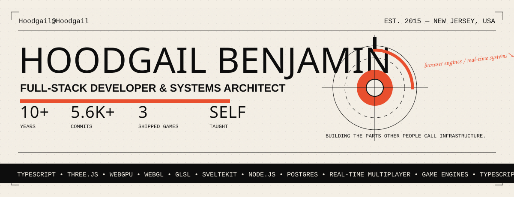
  </a>

 

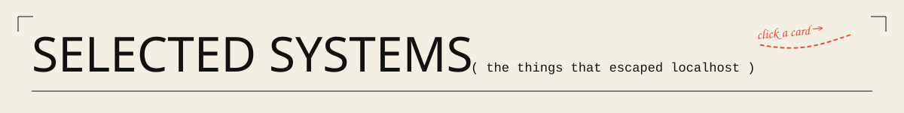

<table>
  <tr>
    <td width="50%" valign="top">
      <a href="https://sicar.io">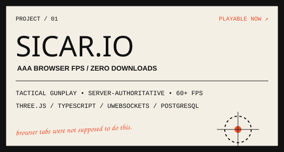</a>
    </td>
    <td width="50%" valign="top">
      <a href="https://github.com/Hoodgail/opentales">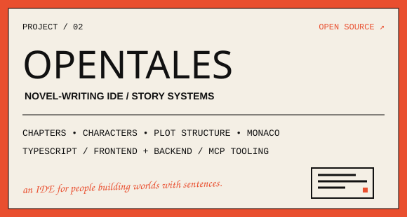</a>
    </td>
  </tr>
  <tr>
    <td width="50%" valign="top">
      <a href="https://github.com/Hoodgail/three-blockbench">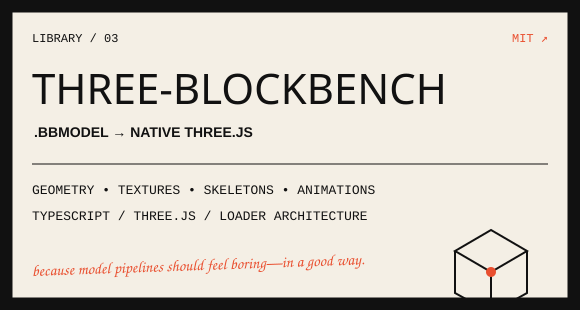</a>
    </td>
    <td width="50%" valign="top">
      <a href="https://github.com/Hoodgail/three-query-selector">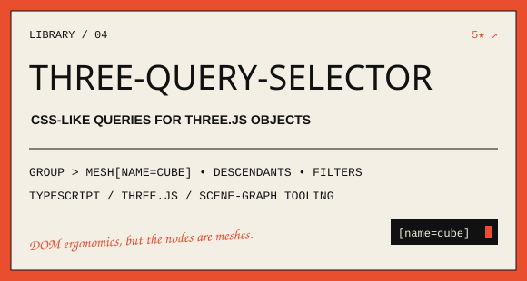</a>
    </td>
  </tr>
  <tr>
    <td width="50%" valign="top">
      <a href="https://github.com/Hoodgail/morphia">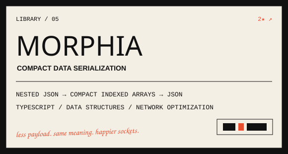</a>
    </td>
    <td width="50%" valign="top">
      <a href="https://watchlist.hoodgail.me">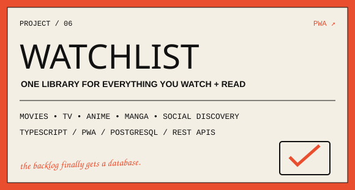</a>
    </td>
  </tr>
</table>

 

<a href="https://hoodgail.me">
  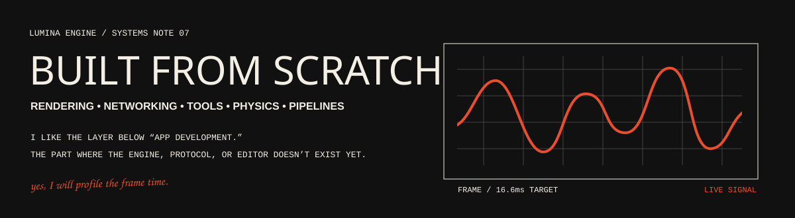
</a>

 

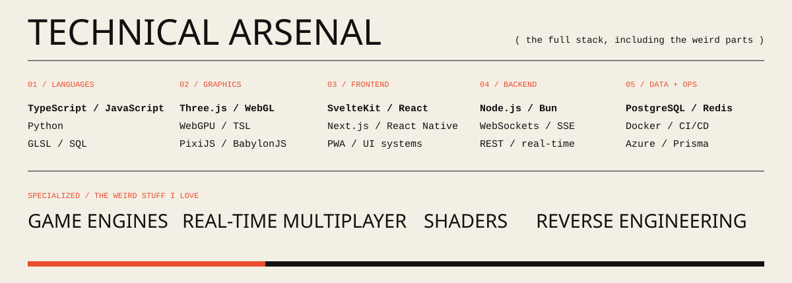

 

<a href="mailto:hoodgail.ben@gmail.com">
  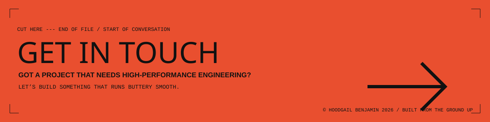
</a>

  
    <a href="https://hoodgail.me">portfolio</a>
    &nbsp;·&nbsp;
    <a href="https://github.com/Hoodgail">github</a>
    &nbsp;·&nbsp;
    <a href="https://www.linkedin.com/in/hoodgail">linkedin</a>
    &nbsp;·&nbsp;
    <a href="mailto:hoodgail.ben@gmail.com">email</a>
  

